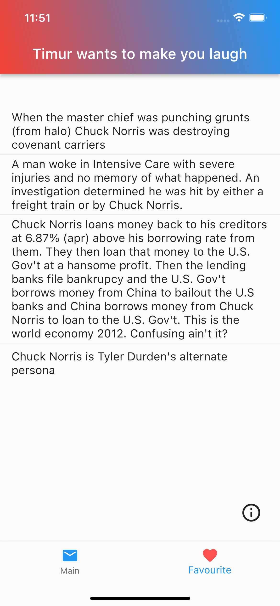

# funny_chuck

Timur Norris wants to make you laugh

In this hard period of time we need to have an opportunity to see an infinite number of jokes.
api.chucknorris.io did it for us

## Functional

(1)We have main page where we can see jokes and change them by clicking NiceButton or swipe it for left or right
(2)If you will swipe it only in right it will be added in favorite list where you can reread them
(3)Search through words in third page
(4)And we have info button in the bottom right side of screen, clicking on it will display contacts of developer me:)

  

[APK link]()