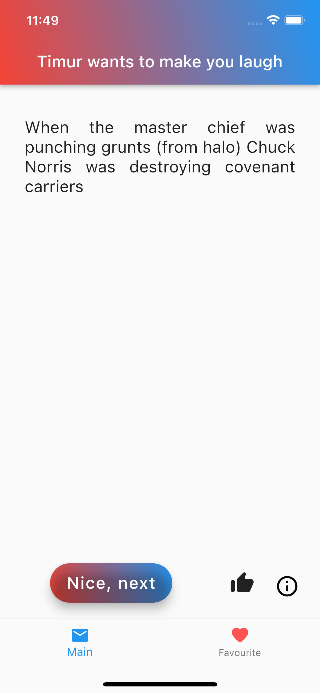

# funny_chuck

My first flutter project to have fun and read all Chuck Norris's jokes
In this hard period of time we need to have an opportunity to see an infinite number of jokes.
api.chucknorris.io did it for us

## Functional

(1)We have main page where we can see jokes and change them by clicking NiceButton or swipe it for left or right
(2)And we have info button in the bottom right side of screen, clicking on it will display contacts of developer me:)

 

[APK](build/app/outputs/flutter-apk/app-release.apk)